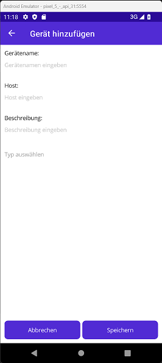

## Eine App für das Steuern von SweetsRandomizer Geräten

### Hauptmenü
Jedes hinzugefügte Gerät wird in der Übersicht mitsamt Name, Hostadresse und Verbindungsstatus angezeigt.
Der Verbindungsstatus wird anhand einer Farbe verdeutlicht.


> ## Information:
> Die Farben haben folgende Bedeutung:
> - Rot -> Nicht erreichbar (Timeout oder gar nicht existent)
> - Gelb -> Erreichbar, aber das Verhalten ist nicht dessen Kategorie entsprechend
> - Grün -> Erreichbar und einsatzbereit

## Benutzerhandbuch

### Hinzufügen eines Gerätes
Zum hinzufügen eines neuen Geräts, sollten beide Endpunkte sich im selben Netzwerk befinden.
Anschließend lässt sich durch das Drücken von "Gerät hinzufügen" ein neues Fenster öffnen, in dem das Gerät näher definiert werden muss.



> ## Achtung:
> Bei dieser Funktion ist die Angabe von folgenden Informationen pflichtig:
> - Gerätename -> Der Name des angezeigten Geräts - Wird für das Anzeigen des Geräts im Hauptmenü benötigt
> - Host -> Die Adressbasis, die zum Gerät zeigt - Nötig für das Ansprechen des jeweiligen Gerätes
> - Typ -> Die Kategorie in die das Gerät gehört - Für das Anzeigen und Nutzen der dementsprechenden Funktionen nötig
>     - ```Hierbei gibt es die Auswahl aus 3 verschiedenen Kategorien: Segmented lights, Spinning lights & Webpage```

##

### Steuern eines Geräts
Zum steuern eines Geräts müssen Sie nur auf das jeweilige Gerät drücken.
Je nach Typ und Verbindungsstatus, ändert sich auch die Ansicht.

#### Webpage Gerät
Da die Kommunikation mit dem Webpage-Gerät einseitig ist, ist dementsprechend das Steuern des Gerätes nicht nötig.
Diesbezüglich gibt es beim wechseln ins Steuerungsmenü keine Steuerungseinheiten.


#### Segmented-Light Gerät
Die Steuerung eines Segmented-Light-Geräts lässt sich durch das Senden von einzelnen Befehlen verwirklichen.
Nicht jeder Befehl benötigt alle Eingabefelder. Dementsprechend werden bei der Auswahl des Befehls, nur die nötigen Eingabefelder editierbar gemacht.


> #### Information:
> Folgende Befehle stehen bei den Segmented lights zur verfügung:
> - Segment einschalten -> Lässt ein Segment (mehrere LEDs) mit der ausgewählten Farbe aufleuchten.
> - Segment exklusiv einschalten -> Lässt ein Segment mit der ausgewählten Farbe aufleuchten. Alle anderen Segmente werden hierbei ausgeschaltet.
> - Auf Hintergrundfarbe setzen -> Lässt alle Segmente mit der gesetzten Hintergrundfarbe aufleuchten.
> - Hintergrundfarbe ändern -> Setzt die Hintergrundfarbe die bei der Funktion "Auf Hintergrundfarbe setzten" benutzt wird. Diese wird beim Neustart des Geräts zurückgesetzt.
> - Alle Segmente einschalten -> Lässt alle Segmente mit der gegebenen Farbe aufleuchten.
> - Alle Segmente ausschalten -> Schaltet alle Segmente aus.

#### Spinning-Light Gerät
Spinning-Light-Geräte besitzen im Gegensatz zu den Segmented lights, keine einfache Kommandostruktur.
Hierbei werden Befehle mittels verschiedener Knöpfe gesendet.


> #### Information:
> Folgende Funktionen stehen bei den Spinning lights zur verfügung:
> - Hebe ein vordefiniertes Segment mit der gegebenen Weite hervor.
> - Hebe eine Reihe an LEDs mit den gegebenen Grenzen hervor.
> - Schalte alle Segmente mit der gegebenen Farbe ein.
> - Schalte alle Segmente aus.
> - Stelle die Animationsgeschwindigkeit in Undrehungen pro Sekunde ein.
> - Stelle die Umdrehungsrichtung ein. (-1 oder 1)
> - Stelle die Hintergrundfarbe ein.
> - Stelle die Vordergrundfarbe ein.
> - Stelle ein, wie viele Pixel ein Segment besitzt.
> - Stelle ein, wie viele Segmente das Gerät besitzt.
